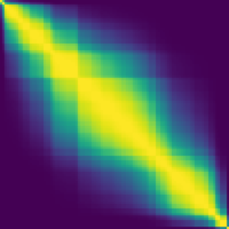

<div id="top"></div>
<!--
*** Thanks for checking out the Best-README-Template. If you have a suggestion
*** that would make this better, please fork the repo and create a pull request
*** or simply open an issue with the tag "enhancement".
*** Don't forget to give the project a star!
*** Thanks again! Now go create something AMAZING! :D
-->


<!-- PROJECT SHIELDS -->
<!--
*** I'm using markdown "reference style" links for readability.
*** Reference links are enclosed in brackets [ ] instead of parentheses ( ).
*** See the bottom of this document for the declaration of the reference variables
*** for contributors-url, forks-url, etc. This is an optional, concise syntax you may use.
*** https://www.markdownguide.org/basic-syntax/#reference-style-links
-->
<!-- [![Contributors][contributors-shield]][contributors-url]
[![Forks][forks-shield]][forks-url]
[![Stargazers][stars-shield]][stars-url]
[![Issues][issues-shield]][issues-url]
[![MIT License][license-shield]][license-url]
[![LinkedIn][linkedin-shield]][linkedin-url] -->


<!-- PROJECT LOGO -->
<br />
<div align="center">
  </a>
    
  </a>

<h3 align="center">GUI Spatial labelling</h3>

  <p align="center">
This GUI allows Alimetry Spatial metrics team to labels the propagation of the stomach waves. 
    <br />
    </a>
    <br />
    <br />
    <!-- <a href="https://github.com/github_username/repo_name">View Demo</a>
    ·
    <a href="https://github.com/github_username/repo_name/issues">Report Bug</a>
    ·
    <a href="https://github.com/github_username/repo_name/issues">Request Feature</a> -->
  </p>
</div>


<!-- TABLE OF CONTENTS -->
<details>
  <summary> Table of Contents </summary>
  <ol>
    <li>
      <a href="#about-the-project">About The Project</a>
      <ul>
        <li><a href="#built-with">Built With</a></li>
      </ul>
    </li>
    <li>
      <a href="#getting-started">Getting Started</a>
      <ul>
        <li><a href="#prerequisites">Prerequisites</a></li>
        <li><a href="#running-the-code">Running the code</a></li>
        <li><a href="#standalone-application">Standalone application</a></li>
      </ul>
    </li>
    <li><a href="#usage-of-the-GUI">Usage</a></li>
    <li><a href="#roadmap">Roadmap</a></li>
    <li><a href="#contributing">Contributing</a></li>
    <li><a href="#license">License</a></li>
    <li><a href="#contact">Contact</a></li>
    <li><a href="#acknowledgments">Acknowledgments</a></li>
  </ol>
</details>


<!-- ABOUT THE PROJECT -->
## About The Project

![Main page][product-screenshot]

This project aims to create a standalone application for macOS to label videos generated by nympy arrays with a size of 8 by 8. This application makes it very easy to label these videos and also facilitate the viewing of the videos. The labeling of videos will generate and save data on the video that can be used to analyze the physics effect appearing on the videos. This project has been produced by Rémi Picard.

<p align="right">(<a href="#top">back to top</a>)</p>


### Built With

* </a> <a href="https://code.visualstudio.com"> Visual Studio Code </a>has been used a along this project to edit the code.
*   </a>    This application has been developped in <a href="https://www.python.org/"> Python v3.10</a> using different libraries :
    
    * <a href="https://docs.python.org/3/library/tkinter.html#module-tkinter">tkinter</a> to develop a Python GUI with several widgets :
        * Tk
        * Frame
        * Label
        * Button 
        * OptionMenu
        * Entry
        * Text 
    * <a href="https://docs.python.org/3/library/tkinter.ttk.html#module-tkinter.ttk">tkinter.ttk</a> for a specific widget :
        * Progressbar
    * <a href=https://docs.python.org/3/library/dialog.html#module-tkinter.filedialog>tkinter.filedialog</a> to allow the user to specify a file to open or save.
    * <a href="https://pandas.pydata.org">Pandas</a> to collect data in arrays and export them in a .csv file.
    * <a href="https://docs.python.org/3/library/os.path.html">os.path</a> to process files from different places in the system.
    * <a href="https://pillow.readthedocs.io/en/stable/">PIL</a> to process images from numpy array (raw data) before displayimg them.
    * <a href="https://numpy.org">numpy</a> to save the raw data in arrays.
    * <a href="https://scipy.org">scipy</a> to interpolate the data.
    * <a href="https://docs.python.org/3/library/glob.html">glob</a> to find all the pathnames matching a specified pattern.
    * <a href="https://matplotlib.org">maplotlib</a> to color the frames of the video with Colormap.</p>
    * <a href="https://matplotlib.org">py2app</a> to create a standalone macOS application from a Python file.

<p align="right">(<a href="#top">back to top</a>)</p>


<!-- GETTING STARTED -->
## Getting Started

This GUI can be used by running the code in a code editor or directly in your mac terminal if the code Python is in your working directory. 

Or you can also create a **standalone application** which will allow the GUI to be used on every macOS devices without needing to have Python installed on it.

### Prerequisites

The software needs the previous libraries to be installed in order to run properly. These librairies and their version are listed in the `requirements.txt` file. You can install all of them by writting the following command in your terminal.

* Requirements
  ```sh
  pip install -r requirements.txt
  ```

* avgWaveData8by8</p>
You need to put the numpy arrays 8by8 containing the raw data you want to label in the **avgWaveData8by8** folder. The name of the arrays should be 
**{case}.npy**


### Running the code

1. Download the latest version of <a href="https://www.python.org/downloads/">Python</a> (v3.10) 
2. Clone the repository in a chosen directory
   ```sh
   git clone https://github.com/remPicard/GUI_SpatialLabelling.git
   ```
3. Make sure the folders `GUI_images` and `numpyArrays8by8` are in the same directory as the code `GUI.py` before you execute it.

4. Execute the code `GUI.py` 
   ```py
   python3 GUI.py
   ```

5. Read the instructions to know how to use correctly the GUI. They are  included in one of the page of the GUI.


### Standalone application

You can also create a standalone macOS application of the GUI if you execute the code `setup.py` with the py2app Python setuptools command.  

1. Install py2app using this command in the terminal.
   ```py
   python3 pip install -U py2app
   ```
2. Make sure the file **GUI.py** and the folders **GUI_images** and **numpyArrays8by8** are in the same directory as the code `setup.py` before you execute it.

3. Clean up your build directories in your working directory
   ```py
   rm -rf build dist
   ```

4. Build the app in your working directory
   ```py
   python3 setup.py py2app
   ```

5. Find the app in the dist folder which has been created in your current directory and move this application to your Applications directory.

6. Use the app on your device or share it to other mac users. Each time a feature will be added in the code, the application will need to be rebuild to have this new feature.

<p align="right">(<a href="#top">back to top</a>)</p>


<!-- USAGE EXAMPLES -->
## Usage of the GUI

To use correclty this application, please read the instructions contained in the pages of the GUI. These instructions will teach you how to label the videos and to use effectively the GUI with the keyboard shortcuts included. </p>
The code save automatically your labelling work in the csv file you are currently working in. So no need to save your work at the end and do not worry if something wrong like a crash or a bug happen on your computer.

<p align="right">(<a href="#top">back to top</a>)</p>


<!-- ROADMAP -->
## Roadmap

- [x] Header 
    - [x] Logo and welcome page
- [x] 1-window design 
    - [x] Direction drop-down menu
    - [x] Stability drop-down menu
    - [x] Confidence drop-down menu
    - [x] Display .mp4 video
        - [x] Looping video
- [x] show data already filled in 
- [x] Progressbar at the top to switch between different time slots
- [x] Labelling instructions 
    - [x] V0
    - [x] V1
- [x] Start a new labelling work
    -[ ] Iterate name if a new one exists already
- [x] 3-window design (display previous and next video)
    - [x] Direction drop-down menu
    - [x] Satbility drop-down menu
    - [x] Comment section (optional)
    - [x] show data for previous and next picture if already filled in
    - [x] Display .png frames as video
- [x] Resume labelling 
    - [x] From a .csv file
- [x] GUI instructions 
    - [x] V0
- [x] Indicate cases and picture already treated
    - [x] Color of buttons in the progressbar
    - [x] Symbol next to a treated case 
        - [x] Improve speed by updating the list at every case
- [x] Display processed numpy arrays as frames of a video 
- [x] Decrease size of the application 
    - [x] Use raw array without processing 

See the [feedback](https://bitbucket.org/alimetry/r-d-gui/src/master/feedback.txt) for a full list of proposed features (and known issues).

<p align="right">(<a href="#top">back to top</a>)</p>


<!-- CONTRIBUTING -->
## Contributing

Contributions of any sort will be **greatly appreciated**.

If you have a suggestion that would improve the code, please 
let me know by contacting me or any member of the Alimetry Spatial metrics member. Or you can directly fork the repository and create a pull request. 

1. Fork the Project
2. Create your Feature Branch (`git checkout -b feature/AddFeature`)
3. Commit your Changes (`git commit -m 'Add some new feature'`)
4. Push to the Branch (`git push origin feature/AddFeature`)
5. create a pull request

You can also simply write your suggestion in the `feedback.txt` file and we will see want we can do.
Thanks again!

<p align="right">(<a href="#top">back to top</a>)</p>


<!-- CONTACT -->
## Contact

Remi Picard - remi.picard03@gmail.com

GitHub Link: [https://github.com/remPicard](https://github.com/remPicard)

<p align="right">(<a href="#top">back to top</a>)</p>


<!-- ACKNOWLEDGMENTS -->
## Acknowledgments

* []()


<p align="right">(<a href="#top">back to top</a>)</p>


<!-- MARKDOWN LINKS & IMAGES -->
<!-- https://www.markdownguide.org/basic-syntax/#reference-style-links -->

[product-screenshot]: ./GUI_images/screenshot.png
[logo]: ./GUI_images/application.png
